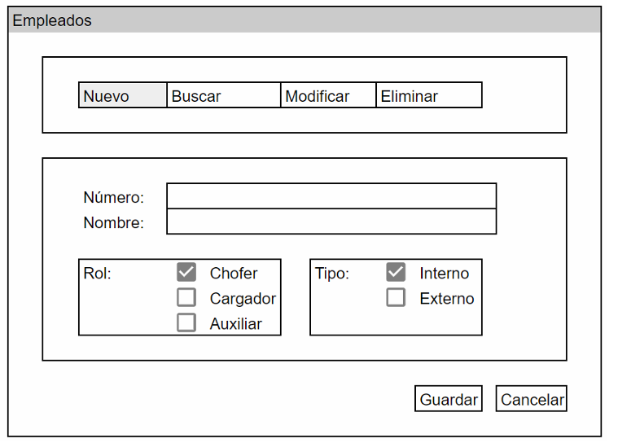
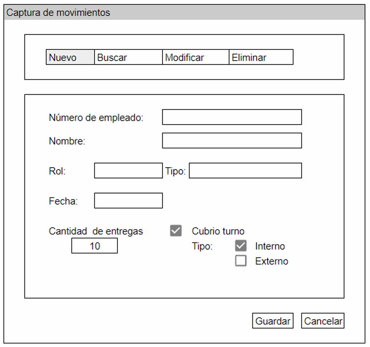

# Practica Desarrollo

## Descripcion

La empresa japonesa cinematografia Rinku te ha contactado por que conocen tu
experiencia ene el desarrollo de soluciones, ademas saben que has trabajado ya en
proyectos de TI relacionados con sueldos y compensaciones.

Despues de una entrevistas con el encargado de nominas, se han obtenido los
requerimientos funcionales:

- Los roles que juegan los trabajadores son: _choferes_, _cargadores_ y _auxiliares_
  (pueden ser internos de Rinku o SubContratados).
- Los trabajadores tienen un sueldo base de $30 pesos la hora, tienen una jornada
  laboral de 8 horas.
- Adicionalmente, se les paga $5.00 por cada entrega que hagan al cliente en el
  recorrido de su jornada laboral.
- Los choferes reciben $10.00 de bono por hora, los cargadores 5.00 de bono por
  hora y los auxiliares no reciben bonos.
- Los trabajadores auxiliares pueden cubrir a los choferes y cargadores en caso de
  que alguno de ellos falte, si esto pasa reciben el bono correspondiente.
- Se retiene a todos los empleados un 9% de impuesto sobre la renta (ISR). Aquellos
  empleados que en su sueldo mensual sobrepasan los $16,000.00 se les debe
  retener un 3% adicional de ISR.
- Los empleados reciben un 4% sobre su sueldo mensual en vales de despensa
  (antes de impuestos, esto no aplica para los subcontratados).

Durante la entrevista se han realizado en conjunto con el encargado de nomina unos
esquemas de interfaz de usuario (wireframes) que pueden servir de guia, pero el encargado
de nomina esta abierto a otras propuestas, las maquetas se muestran a continuacion.

### Directivas

- Debes utilizar una herramienta de control de versiones, por ejemplo: GitHub
  para candidatos externos y Gitlab para candidatos internos, y crear un repositorio en el
  cual deberas guardar el codigo fuente del sistema.
- Al realizar el sistema, recuerda dejar evidencia de los cambios utilizando la
  herramienta de control de versiones anteriormente recomendada.
- Puedes usar los frameworks que mejor domines.
- El codigo fuente debe estar documentado y debes confirmar el codigo fuente que
  hayas modificado (realizar commits diarios)
- Para dar a conocer el diseño del sistema, es importante usar diagramas UML.
- El encargado quiere ver funcionando este sistema en _una semana_.
- Dicho sistema debe tener una arquitectura (patron de arquitectura) y debe
  realizarse respetando el ciclo de vida de desarrollo de software SDLC por lo tanto se
  te pide lo siguiente:

A. Realizar un analisis de los requerimientos funcionales e identificar las entradas,
procesos y salidas.

1. Requerimientos.
2. Entradas.
3. Procesos.
4. Salidas.

B. Realiza un diagrama de secuencia para el proceso del calculo del sueldo mensual,
reucerda que puedes hacer los diagramas de los demas procesos si los deseas.

C. En la siguiente tabla redacta 3 casos de prueba para el proceso de calculo de sueldo
mensual.

| ID  | Descripcion de la prueba | Entradas | Salida Esperada |
| --- | ------------------------ | -------- | --------------- |
|     |                          |          |                 |
|     |                          |          |                 |
|     |                          |          |                 |

D. Codifica utilizando las herramientas de tu eleccion (debes hacer una lista de las
herramientas y sus versiones)

1. IDEs y herramientas utilizados (Entorno de desarrollo)
2. Que versiones usaste
3. Como se ambiento el equipo

E. corre las pruebas que diseñaste, llena el reporte de pruebas en la tabla y explica si
fallaron y por que, en el caso de que no haya falla, solamente llena el resultado de las
pruebas.

| ID  | Descripcion de la prueba | Resultado de la prueba | Por que fallo |
| --- | ------------------------ | ---------------------- | ------------- |
|     |                          |                        |               |
|     |                          |                        |               |
|     |                          |                        |               |
